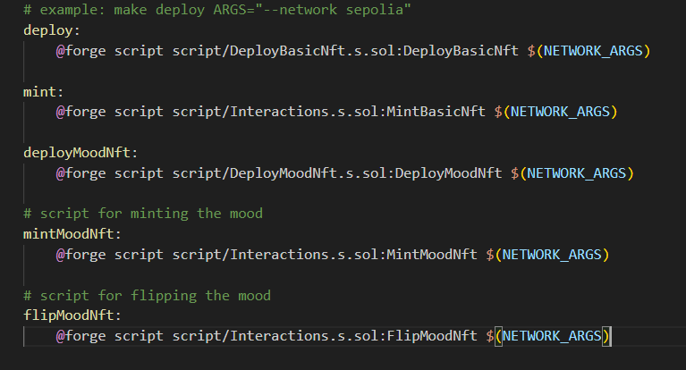

# Foundry Smart Contract NFT Project

This is a section of the Cyfrin Foundry Solidity Course.
 - This project contrains two main NFTs (BasicNFT, MoodNFT)

 - BasicNFT's is stored on ipfs 👍
 - MoodNFT's is stored on chain 👌


# Getting Started

## Requirements

- [git](https://git-scm.com/book/en/v2/Getting-Started-Installing-Git)
  - You'll know you did it right if you can run `git --version` and you see a response like `git version x.x.x`
- [foundry](https://getfoundry.sh/)
  - You'll know you did it right if you can run `forge --version` and you see a response like `forge 0.2.0`

## Quickstart

```
git clone https://github.com/nzlatev7/smart-contract-nft
cd smart-contract-nft
forge build
```

# Usage

## Start a local node

```
make anvil
```

## Deploy

This will default to your local node. You need to have it running in another terminal in order for it to deploy.

```
make deploy
```

## Deploy - Other Network

[See below](#deployment-to-a-testnet-or-mainnet)

### Testing on network 

 - anvil
```
forge test
```

- testnet (sepolia in this case)

```
forge test --fork-url $SEPOLIA_RPC_URL
```

# Deployment to a testnet or mainnet

- you can check the Makefile which contain all interactions (minting, deploying, fliping)


